# kiwikee

>*kiwikee* is a small, low cost 3D printable robot , for fun & educational purposes for kids !
- its is a remake/ expansion of the [SMARS modular robot](https://www.thingiverse.com/thing:2662828) in OpenJSCAD!
- it has a custom emitter/ reciever using the Wemos D1 Mini Esp8266 modules
- it has a custom PCB for the robot itself, for simple plugeable sensors & effectors

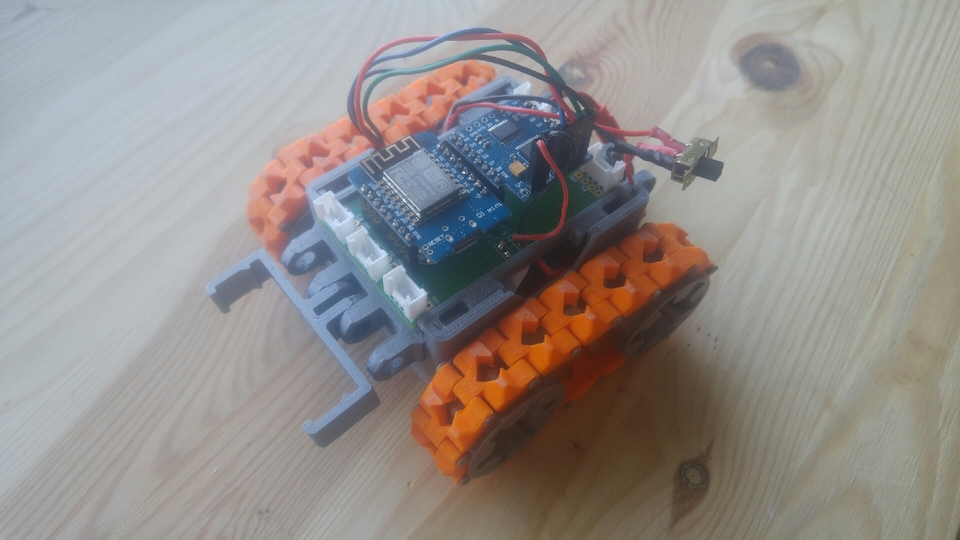
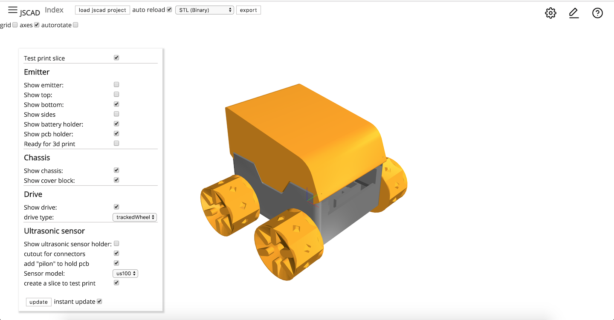

[](https://github.com/emersion/stability-badges#experimental)


## Table of Contents

- [Features](#features)
- [Bom](#bom)
- [Usage](#usage)
- [License](#license)
- [Pictures](#pictures)

## Features

- robotic body based on the great [SMARS modular robot](https://www.thingiverse.com/thing:2662828), but entirely parametric !
  - with added 
  - change the design to fit your needs !
  - integrated battery holder for 2 X AA batteries (LifePO4)
  - removeable electronics holder
  - customizeable SMARS connectors: 1x , 10x , 200x ? you choose & print !
- simple & quick to 3d print
- either RC mode or autonomous (based on your wants & needs & available sensors)
- attach different sensors for fun & learning (ultrasonic distance sensor, a led matrix 'face' etc)
- custom PCB design for the robot/reciever exposing 
  - 2 x I2C ports
  - 4 x general IO
  - use grove or standard pins for connectors

you can see the robot in action here :

[](https://www.youtube.com/watch?v=v64-LwME9pc)

## Bom

Robot/Reciever:
- 3d printed parts
- electronics (total : 78€)
  - 1 x Wemos D1 Mini (5€)
  - 1 x Wemos D1 Mini Motor Shield (6€)
  - 1 x Custom Pcb (or diy, it is very simple, really) (7€)
  - 2 x LifePo4 3.2v batteries (10€)
  - 1 x UBEC 5V / buck converter (10€)
  - 2 x 150:1 MICRO METAL GEARMOTOR HPCB 6V (35€)
  - various headers & wires, switches, battery holder parts etc (5€)

Emitter (optional):
- 3d printed parts
- electronics (total : 31€)
  - 1 x Wemos D1 Mini (5€)
  - 1 x Wemos D1 Mini Oled Shield (8€)
  - 1 x Wemos trippler board (2€)
  - 1 X Joystick (6€)
  - 1 x LifePo4 3.2v batteries (5€)
  - various headers & wires, switches, battery holder parts etc (5€)

> note: prices are not the lowest: I tried to go the reliable/ local / higher quality: if you want to go cheaper I 
am pretty much certain you can get the electronics & motors et for a quarter of tha

## Usage

### CAD: 
This package can currently only be used in the new version of JSCAD web V2 (written as npm module)
- install the web ui for JSCAD V2 (branch web-overhaul for now)
- clone this repository
- drag & drop this [folder](./cad/kiwikee) onto the JSCAD UI

### Firmware

both parts of the firmware where developped using [PlatformIo](https://platformio.org/) so ...
- install PlatformIo first
- connect the electronics (either emitter or reciever based on what you need)
-  emitter (optional): you can find the code [here](./firmware-emitter)
-  reciever/ robot (needed): you can find the code [here](./firmware-reciever)
- go into the adapted folder above & type ```pio run && pio run -t upload``` (to compile & upload)
- have fun!

### Electronics / PCb 

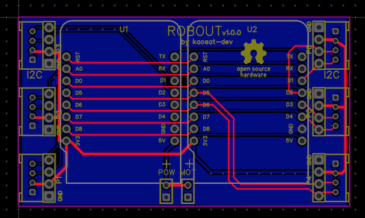

This was my first custom PCB, and is just a simple breakout board to put a Wemos D1 Mini & a motor shield
and expose I2C & IO pins in the form of either Grove connectors or simple pins (there are connections & holes to 
solder either )
- I designed it using easyEda, but might do a Kicad version at some stage (open source power !)
- the gerber files are [here](./electronics)


## License

All parts based on the original SMARS have the same license as the original: 
 Creative Commons - Attribution - Non-Commercial - Share Alike
All new parts 
- remote control 
- firmware
- pcb design
- etc
use the [The MIT License (MIT)](./LICENSE)
(unless specified otherwise)

## Pictures

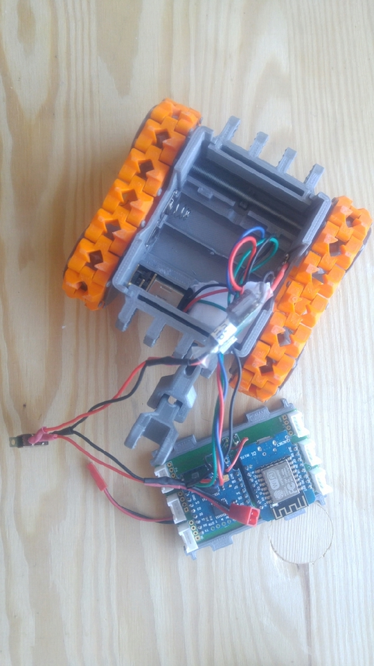
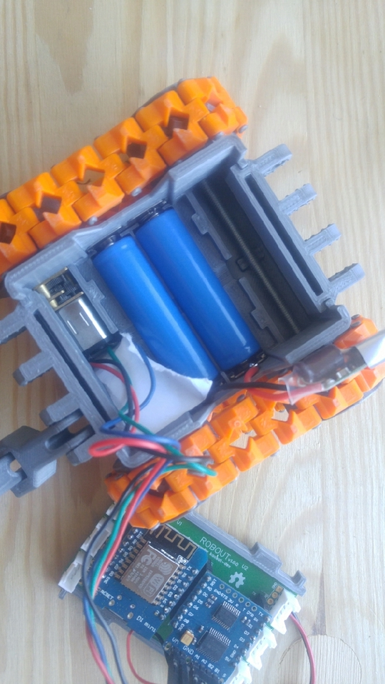


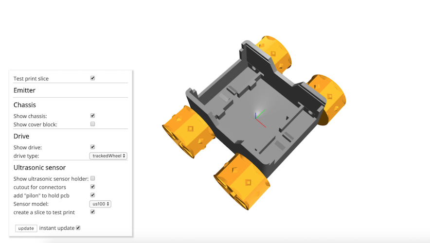

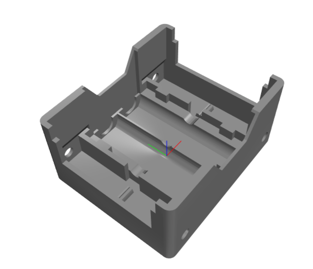
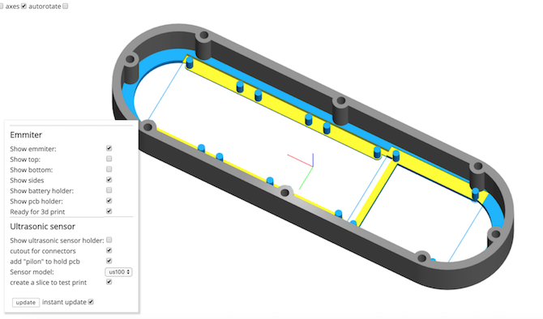
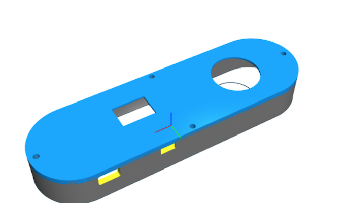
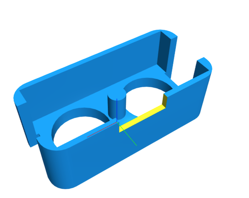
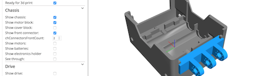
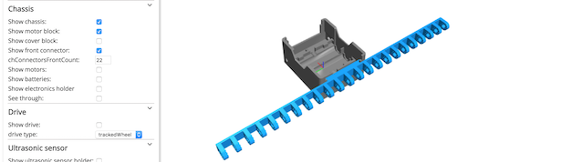

